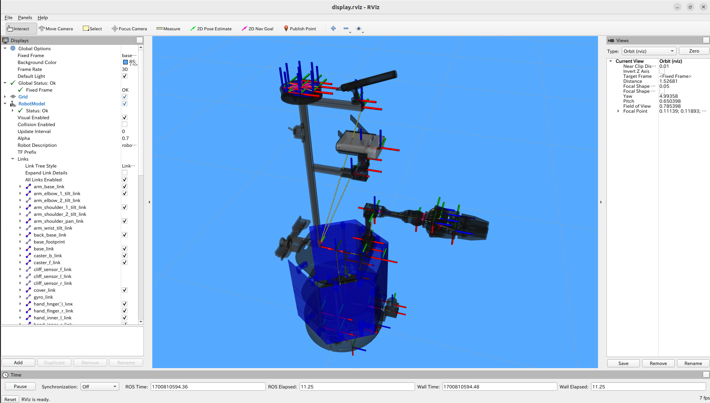

<a name="readme-top"></a>

[JA](README.md) | [EN](README.en.md)

[![Contributors][contributors-shield]][contributors-url]
[![Forks][forks-shield]][forks-url]
[![Stargazers][stars-shield]][stars-url]
[![Issues][issues-shield]][issues-url]
[![License][license-shield]][license-url]

# SOBIT EDU

<!-- TABLE OF CONTENTS -->
<details>
  <summary>Table of Contents</summary>
  <ol>
    <li>
      <a href="#introduction">Introduction</a>
    </li>
    <li>
      <a href="#getting-started">Getting Started</a>
      <ul>
        <li><a href="#prerequisites">Prerequisites</a></li>
        <li><a href="#installation">Installation</a></li>
      </ul>
    </li>
    <li>
    　<a href="#launch-and-usage">Launch and Usage</a>
      <ul>
        <li><a href="#visualization-on-rviz<">Visualization on Rviz</a></li>
      </ul>
    </li>
    <li>
    　<a href="#software">Software</a>
      <ul>
        <li><a href="#joint-controller">Joint Controller</a></li>
        <li><a href="#wheel-controller">Wheel Controller</a></li>
      </ul>
    </li>
    <li>
    　<a href="#hardware">Hardware</a>
      <ul>
        <li><a href="#how-to-download-3d-parts">How to download 3D Parts</a></li>
        <li><a href="#robot-assembly">Robot Assembly</a></li>
        <li><a href="#features">Features</a></li>
        <li><a href="#bill-of-material-BOM">Bill of Material (BOM)</a></li>
      </ul>
    </li>
    <li><a href="#milestone">Milestone</a></li>
    <!-- <li><a href="#contributing">Contributing</a></li> -->
    <!-- <li><a href="#license">License</a></li> -->
    <li><a href="#acknowledgments">Acknowledgments</a></li>
  </ol>
</details>


<!-- INTRODUCTION -->
## Introduction


This is a library to operate the mobile manipulator (SOBIT EDU) developed by SOBITS based on TurtleBot2.

> [!WARNING]
> If you have no preivous experience controlling this robot, please have a senior colleague accompany you while you want to use this robot.

<p align="right">(<a href="#readme-top">back to top</a>)</p>


<!-- GETTING STARTED -->
## Getting Started

This section describes how to set up this repository.

### Prerequisites

First, please set up the following environment before proceeding to the next installation stage.

| System  | Version |
| ------------- | ------------- |
| Ubuntu | 20.04 (Focal Fossa) |
| ROS | Noetic Ninjemys |
| Python | 3.8 |

> [!NOTE]
> If you need to install `Ubuntu` or `ROS`, please check our [SOBITS Manual](https://github.com/TeamSOBITS/sobits_manual#%E9%96%8B%E7%99%BA%E7%92%B0%E5%A2%83%E3%81%AB%E3%81%A4%E3%81%84%E3%81%A6).

### Installation

1. Go to the `src` folder of ROS.
   ```sh
   $ roscd
   # Or just use "cd ~/catkin_ws/" and change directory.
   $ cd src/
   ```
2. Clone this repository.
   ```sh
   $ git clone https://github.com/TeamSOBITS/sobit_edu
   ```
3. Navigate into the repository.
   ```sh
   $ cd sobit_edu/
   ```
4. Install the dependent packages.
   ```sh
   $ bash install.sh
   ```
5. Compile the package.
   ```sh
   $ roscd
   # Or just use "cd ~/catkin_ws/" and change directory.
   $ catkin_make
   ```


<p align="right">(<a href="#readme-top">back to top</a>)</p>


<!-- LAUNCH AND USAGE EXAMPLES -->
## Launch and Usage

1. Set the parameters inside [minimal.launch](sobit_edu_bringup/launch/minimal.launch) and select the functions to launch with SOBIT EDU.
   ```xml
    <!-- Activate Mobile-Base (true), Arm (true), Head (true) -->
    <arg name="enable_mb"           default="true"/>
    <arg name="enable_arm"          default="true"/>
    <arg name="enable_head"         default="true"/>
    ...
    <arg name="open_rviz"           default="true"/>
    ...
   ```
> [!NOTE]
> Rewrite it as `true` or `false` depending on the functions you want to use.

2. Execute the launch file [minimal.launch](sobit_edu_bringup/launch/minimal.launch).
   ```sh
   $ roslaunch sobit_edu_bringup minimal.launch
   ```
3. [Optional] Let's run the demo program.
   ```sh
   $ rosrun sobit_edu_library test_controll_wheel.py
   ```

> [!NOTE]
> Check the [example](sobit_edu_library/example/) folder to become familiar with how SOBIT EDU works, and learn the working functions from each sample file.

<p align="right">(<a href="#readme-top">back to top</a>)</p>


### Visualize on Rviz
As a preliminary step to running the actual machine, SOBIT EDU can be visualized on Rviz to display the robot's configuration.

```sh
$ roslaunch sobit_edu_description display.launch
```

If it works correctly, Rviz will be displayed as follows.


<p align="right">(<a href="#readme-top">back to top</a>)</p>


## Software
<details>
<summary>Summary of information on SOBIT EDU and related software</summary>


### Joint Controller
This is a summary of information for moving the pan-tilt mechanism and manipulators of SOBIT EDU.

<p align="right">(<a href="#readme-top">back to top</a>)</p>


#### Movement Methods
1.  `moveToPose()` : Move it to a predetermined pose.
    ```cpp
    bool moveToPose(
        const std::string& pose_name,   // Pose name
        const double sec = 5.0          // Moving duration [s]
    );
    ```

> [!NOTE]
> Existing poses are found in [sobit_edu_pose.yaml](sobit_edu_library/config/sobit_edu_pose.yaml). Please refer to [How to set new poses](#how-to-set-new-poses) for how to create poses.

2.  `moveJoint()` : Moves a specified joint to an arbitrary angle.
    ```cpp
    bool sobit::SobitEduJointController::moveJoint (
        const Joint joint_num,          // Joint Number (Defined)
        const double rad,               // Moving Angle [rad]
        const double sec = 5.0,         // Moving Duration [s]
        bool is_sleep = true            // Flag for sleep after movement
    );
    ```

> [!NOTE]
> `Joint Number` please check [Joints Name](#joints-name).

3.  `moveAllJoint()` : Moves all joints to an arbitrary angle.
    ```cpp
    bool sobit::SobitEduJointController::moveJoint (
        const double arm_shoulder_pan,  // Moving Angle [rad]
        const double arm_shoulder_tilt, // Moving Angle [rad]
        const double arm_elbow_tilt,    // Moving Angle [rad]
        const double arm_wrist_tilt,    // Moving Angle [rad]
        const double hand,              // Moving Angle [rad]
        const double head_camera_pan,   // Moving Angle [rad]
        const double head_camera_tilt,  // Moving Angle [rad]
        const double sec = 5.0,         // Moving Angle [s]
        bool is_sleep = true            // Flag for sleep after movement
    );
    ```

1.  `moveHeadPanTilt()` : Moves the pan-tilt mechanism to an arbitrary angle.
    ```cpp
    bool sobit::SobitEduJointController::moveHeadPanTilt(
        const double pan_rad,           // Moving Angle [rad]
        const double tilt_rad,          // Moving Angle [rad]
        const double sec = 5.0,         // Moving Duration [s]
        bool is_sleep = true            // Flag for sleep after movement
    );
    ```
 
1.  `moveArm()` : Moves the robot arm joints to an arbitrary angle.
    ```cpp
    bool sobit::SobitEduJointController::moveArm(
        const double arm_shoulder_pan,  // Moving Angle [rad]
        const double arm_shoulder_tilt, // Moving Angle [rad]
        const double arm_elbow_tilt,    // Moving Angle [rad]
        const double arm_wrist_tilt,    // Moving Angle [rad]
        const double hand,              // Moving Angle [rad]
        const double sec = 5.0,         // Moving Duration [s]
        bool is_sleep = true            // Flag for sleep after movement
    );
    ```


1.  `moveGripperToTargetCoord()` : Move the hand to xyz coordinates (grasp mode).
    ```cpp
    bool sobit::SobitEduJointController::moveGripperToTargetCoord(
        const double goal_position_x,       // Grasp destination x [m]
        const double goal_position_y,       // Grasp destination y [m]
        const double goal_position_z,       // Grasp destination z [m]
        const double diff_goal_position_x,  // Shift the x-axis [m]
        const double diff_goal_position_y,  // Shift the y-axis [m]
        const double diff_goal_position_z   // Shift the z-axis [m]
    );
    ```

1.  `moveGripperToTargetTF()` : Moves the hand to the tf name (grasp mode).
    ```cpp
    bool sobit::SobitEduJointController::moveGripperToTargetTF(
        const std::string& target_name,     // Grasp Target tf name
        const double diff_goal_position_x,  // Shift the x-axis [m]
        const double diff_goal_position_y,  // Shift the y-axis [m]
        const double diff_goal_position_z   // Shift the z-axis [m]
    );
    ```

1.  `moveGripperToPlaceCoord()` : Moves the hand to xyz coordinates (placement mode).
    ```cpp
    bool sobit::SobitEduJointController::moveGripperToPlaceCoord(
        const double goal_position_x,       // Place destination x [m]
        const double goal_position_y,       // Place destination y [m]
        const double goal_position_z,       // Place destination z [m]
        const double diff_goal_position_x,  // Shift the x-axis [m]
        const double diff_goal_position_y,  // Shift the y-axis [m]
        const double diff_goal_position_z   // Shift the z-axis [m]
    ); 
    ```

1.  `moveGripperToPlaceTF()` : Moves the hand to the tf name (placement mode).
    ```cpp
    bool sobit::SobitEduJointController::moveGripperToPlaceTF(
        const std::string& target_name,     // Place Target tf name
        const double diff_goal_position_x,  // Shift the x-axis [m]
        const double diff_goal_position_y,  // Shift the y-axis [m]
        const double diff_goal_position_z   // Shift the z-axis [m]
    );
    ```

1.  `graspDecision()` : Based on the hand current value , the grasp judgment is returned.
    ```cpp
    bool sobit::SobitEduJointController::graspDecision(
        const int min_curr = 300,       // Minimum current value
        const int max_curr = 1000       // Maximum current value
     );
    ```

1.  `placeDecision()` : Based on the hand current value , the place judgment is returned.
    ```cpp
    bool sobit::SobitEduJointController::graspDecision( 
        const int min_curr = 500,       // Minimum current value
        const int max_curr = 1000       // Maximum current value
    );
    ```

<p align="right">(<a href="#readme-top">back to top</a>)</p>


#### Joints name
The joint names of SOBIT EDU and their constants are listed below.


| Joint Number | Joint Name | Joint Constant Name |
| :---: | --- | --- |
| 0 | arm_shoulder_pan_joint | ARM_SHOULDER_PAN_JOINT |
| 1 | arm_shoulder_1_tilt_joint | ARM_SHOULDER_1_TILT_JOINT |
| 2 | arm_shoulder_2_tilt_joint | ARM_SHOULDER_2_TILT_JOINT |
| 3 | arm_elbow_1_tilt_joint | ARM_ELBOW_1_TILT_JOINT |
| 4 | arm_elbow_2_tilt_joint | ARM_ELBOW_2_TILT_JOINT |
| 5 | arm_wrist_tilt_joint | ARM_WRIST_TILT_JOINT |
| 6 | hand_joint | HAND_JOINT |
| 7 | head_camera_pan_joint | HEAD_CAMERA_PAN_JOINT |
| 8 | head_camera_tilt_joint | HEAD_CAMERA_TILT_JOINT |


<p align="right">(<a href="#readme-top">back to top</a>)</p>


#### How to set new poses
Poses can be added and edited in the file [sobit_edu_pose.yaml](sobit_edu_library/config/sobit_edu_pose.yaml). The format is as follows:


```yaml
sobit_edu_pose:
    - { 
        pose_name: "pose_name",
        arm_shoulder_pan_joint: 0.00,
        arm_shoulder_1_tilt_joint: 1.5708,
        arm_shoulder_2_tilt_joint: -1.5708,
        arm_elbow_1_tilt_joint: -1.40,
        arm_elbow_2_tilt_joint: 1.40,
        arm_wrist_tilt_joint: -0.17,
        hand_joint: -1.00,
        head_camera_pan_joint: 0.00,
        head_camera_tilt_joint: 0.00
    }
    ...
```  

### Wheel Controller
This is a summary of information for moving the SOBIT EDU moving mechanism.

<p align="right">(<a href="#readme-top">back to top</a>)</p>


#### 動作関数
1.  `controlWheelLinear()` : Perform translational motion (straight-line, diagonal, or lateral movement).
    ```cpp
    bool sobit::SobitEduWheelController::controlWheelLinear (
        const double distance,            // Straight travel distance [m]
    )
    ```  
2.  `controlWheelRotateRad()` : Perform rotational motion (method: Radian)
    ```cpp
    bool sobit::SobitEduWheelController::controlWheelRotateRad (
        const double angle_rad,             // Center Rotation Angle [rad]
    )
    ```  
3.  `controlWheelRotateDeg()`   :   Perform rotational motion (method: Degree)
    ```cpp
    bool sobit::SobitEduWheelController::controlWheelRotateDeg ( 
        const double angle_deg,             // Center Rotation Angle (deg)
    )
    ```

</details>

<p align="right">(<a href="#readme-top">back to top</a>)</p>


## Hardware
SOBIT EDU is available as open source hardware at [OnShape](https://cad.onshape.com/documents/0aff733aa8798f27efd96de3/w/e6c482276f9b94eef89215b6/e/a80437dc83d4b5d5f30b153e?renderMode=0&uiState=654e03c33dd8e732221dd868)．


<p align="right">(<a href="#readme-top">back to top</a>)</p>


<details>
<summary>For more information on hardware, please click here.</summary>

### How to download 3D parts

1. Access Onshape.

> [!NOTE]
> You do not need to create an `OnShape` account to download files. However, if you wish to copy the entire document, we recommend that you create an account.

2. `Select the part in `Instances` by right-clicking on it.
2. A list will be displayed, press the `Export` button.
1. In the window that appears, there is a `Format` item. Select `STEP`.
1. Finally, press the blue `Export` button to start the download.

<p align="right">(<a href="#readme-top">back to top</a>)</p>


### Electronic Circuit Diagram
TBD

<p align="right">(<a href="#readme-top">back to top</a>)</p>


### ロボットの特徴
| Item | Details |
| --- | --- |
| Maximum linear velocity | 0.65[m/s] |
| Maximum Rotational Speed | 3.1415[rad/s] |
| Maximum Payload | 0.35[kg] |
| Size (LxWxH) | 640x400x1150[mm] |
| Weight | 10.5[kg] |
| Remote Controller | PS3/PS4 |
| LiDAR | UST-20LX |
| RGB-D | Azure Kinect DK|
| IMU | LSM6DSMUS |
| Speaker | Mono Speaker |
| Microphone | Condenser Microphone |
| Actuator (Arm) |7 x XM430-W320 |
| Movement Mechanism | TurtleBot2 |
| Power Supply | 2 x Makita 6.0Ah 18V |
| PC Connection | USB |

<p align="right">(<a href="#readme-top">back to top</a>)</p>


### 部品リスト（BOM）

| Part | Model Number | Quantity | Where to Buy |
| --- | --- | --- | --- |
| --- | --- | 1 | [link]() |
| --- | --- | 1 | [link]() |
| --- | --- | 1 | [link]() |
| --- | --- | 1 | [link]() |
| --- | --- | 1 | [link]() |
| --- | --- | 1 | [link]() |
| --- | --- | 1 | [link]() |
| --- | --- | 1 | [link]() |
| --- | --- | 1 | [link]() |
| --- | --- | 1 | [link]() |
| --- | --- | 1 | [link]() |
| --- | --- | 1 | [link]() |
| --- | --- | 1 | [link]() |

</details>

<p align="right">(<a href="#readme-top">back to top</a>)</p>


<!-- MILESTONE -->
## Milestone

- [x] Modification of example files
- [x] OSS
    - [x] Improved documentation
    - [x] Unified coding style

See the [open issues][license-url] for a full list of proposed features (and known issues).

<p align="right">(<a href="#readme-top">back to top</a>)</p>


<!-- CONTRIBUTING -->
<!-- ## Contributing

Contributions are what make the open source community such an amazing place to learn, inspire, and create. Any contributions you make are **greatly appreciated**.

If you have a suggestion that would make this better, please fork the repo and create a pull request. You can also simply open an issue with the tag "enhancement".
Don't forget to give the project a star! Thanks again!

1. Fork the Project
2. Create your Feature Branch (`git checkout -b feature/AmazingFeature`)
3. Commit your Changes (`git commit -m 'Add some AmazingFeature'`)
4. Push to the Branch (`git push origin feature/AmazingFeature`)
5. Open a Pull Request

<p align="right">(<a href="#readme-top">上に戻る</a>)</p> -->


<!-- LICENSE -->
<!-- ## License

Distributed under the MIT License. See `LICENSE.txt` for more NOTErmation.

<p align="right">(<a href="#readme-top">上に戻る</a>)</p> -->


<!-- ACKNOWLEDGMENTS -->
## Acknowledgments

* [Dynamixel SDK](https://emanual.robotis.com/docs/en/software/dynamixel/dynamixel_sdk/overview/)
* [ROS Noetic](http://wiki.ros.org/noetic)
* [ROS Control](http://wiki.ros.org/ros_control)

<p align="right">(<a href="#readme-top">back to top</a>)</p>


<!-- MARKDOWN LINKS & IMAGES -->
<!-- https://www.markdownguide.org/basic-syntax/#reference-style-links -->
[contributors-shield]: https://img.shields.io/github/contributors/TeamSOBITS/sobit_edu.svg?style=for-the-badge
[contributors-url]: https://github.com/TeamSOBITS/sobit_edu/graphs/contributors
[forks-shield]: https://img.shields.io/github/forks/TeamSOBITS/sobit_edu.svg?style=for-the-badge
[forks-url]: https://github.com/TeamSOBITS/sobit_edu/network/members
[stars-shield]: https://img.shields.io/github/stars/TeamSOBITS/sobit_edu.svg?style=for-the-badge
[stars-url]: https://github.com/TeamSOBITS/sobit_edu/stargazers
[issues-shield]: https://img.shields.io/github/issues/TeamSOBITS/sobit_edu.svg?style=for-the-badge
[issues-url]: https://github.com/TeamSOBITS/sobit_edu/issues
[license-shield]: https://img.shields.io/github/license/TeamSOBITS/sobit_edu.svg?style=for-the-badge
[license-url]: LICENSE
