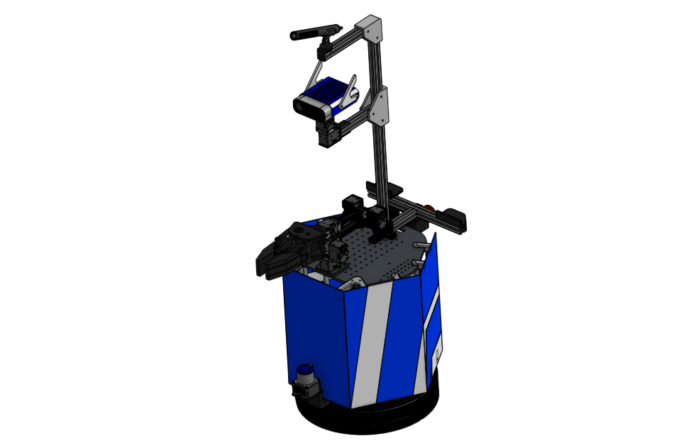
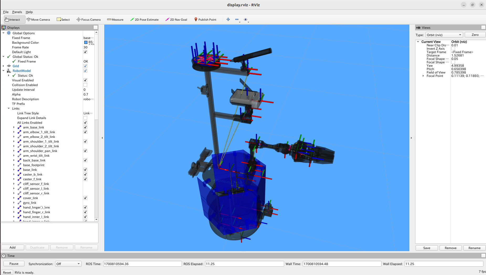
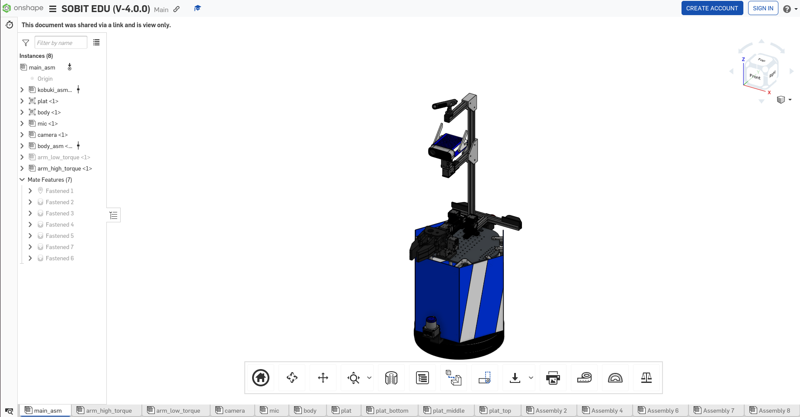

<a name="readme-top"></a>

[JA](README.md) | [EN](README.en.md)

[![Contributors][contributors-shield]][contributors-url]
[![Forks][forks-shield]][forks-url]
[![Stargazers][stars-shield]][stars-url]
[![Issues][issues-shield]][issues-url]
[![License][license-shield]][license-url]

# SOBIT EDU

<!-- 目次 -->
<details>
  <summary>目次</summary>
  <ol>
    <li>
      <a href="#概要">概要</a>
    </li>
    <li>
      <a href="#セットアップ">セットアップ</a>
      <ul>
        <li><a href="#環境条件">環境条件</a></li>
        <li><a href="#インストール方法">インストール方法</a></li>
      </ul>
    </li>
    <li>
    　<a href="#実行・操作方法">実行・操作方法</a>
      <ul>
        <li><a href="#Rviz上の可視化">Rviz上の可視化</a></li>
      </ul>
    </li>
    <li>
    　<a href="#ソフトウェア">ソフトウェア</a>
      <ul>
        <li><a href="#ジョイントコントローラ">ジョイントコントローラ</a></li>
        <li><a href="#ホイールコントローラ">ホイールコントローラ</a></li>
      </ul>
    </li>
    <li>
    　<a href="#ハードウェア">ハードウェア</a>
      <ul>
        <li><a href="#パーツのダウンロード方法">パーツのダウンロード方法</a></li>
        <li><a href="#電子回路">電子回路</a></li>
        <li><a href="#ロボットの特徴">ロボットの特徴</a></li>
        <li><a href="#部品リスト（BOM）">部品リスト（BOM）</a></li>
      </ul>
    </li>
    <li><a href="#マイルストーン">マイルストーン</a></li>
    <!-- <li><a href="#contributing">Contributing</a></li> -->
    <!-- <li><a href="#license">License</a></li> -->
    <li><a href="#参考文献">参考文献</a></li>
  </ol>
</details>


<!-- レポジトリの概要 -->
## 概要



TurtleBot2をベースとしてSOBITSが開発したモバイルマニピュレータ（SOBIT EDU）を動かすためのライブラリである．

> [!WARNING]
> 初心者の場合，実機のロボットを扱う際に，先輩方に付き添ってもらいながらロボットを動かしょう．

<p align="right">(<a href="#readme-top">上に戻る</a>)</p>


<!-- セットアップ -->
## セットアップ

ここで，本レポジトリのセットアップ方法について説明する．

<p align="right">(<a href="#readme-top">上に戻る</a>)</p>


### 環境条件

まず，以下の環境を整えてから，次のインストール段階に進んでください．

| System  | Version |
| ------------- | ------------- |
| Ubuntu | 22.04 (Jammy Jellyfish) |
| ROS | Humble Hawksbill |
| Python | 3.10 |

> [!NOTE]
> `Ubuntu`や`ROS`のインストール方法に関しては，[SOBIT Manual](https://github.com/TeamSOBITS/sobits_manual#%E9%96%8B%E7%99%BA%E7%92%B0%E5%A2%83%E3%81%AB%E3%81%A4%E3%81%84%E3%81%A6)に参照してください．

<p align="right">(<a href="#readme-top">上に戻る</a>)</p>

### インストール方法

1. ROSの`src`フォルダに移動する．
   ```sh
   $ cd ~/colcon_ws/src/
   ```
2. 本レポジトリをcloneする．
   ```sh
    $ git clone https://github.com/TeamSOBITS/sobit_edu
   ```
3. レポジトリの中へ移動する．
   ```sh
   $ cd sobit_edu/
   ```
4. 依存パッケージをインストールする．
   ```sh
   $ bash install.sh
   ```
5. パッケージをコンパイルする．
   ```sh
    $ cd ~/colcon_ws/
    $ colcon build --symlink-install
    $ source ~/colcon_ws/install/setup.sh
   ```

<p align="right">(<a href="#readme-top">上に戻る</a>)</p>

<!-- 実行・操作方法 -->
## 実行・操作方法
実機のロボットを起動する場合は[minimal.launch.py](sobit_edu_bringup/launch/minimal.launch.py)を実行する．
   ```sh
   $ ros2 launch sobit_edu_bringup minimal.launch.py
   ```

<p align="right">(<a href="#readme-top">上に戻る</a>)</p>


### Rviz上の可視化

実機を動かす前段階として，Rviz2上でSOBIT EDUを可視化し，ロボットの構成を表示することができます．

```sh
$ ros2 launch sobit_edu_description display.launch.py
```

正常に動作した場合は，次のようにRvizが表示される．


<p align="right">(<a href="#readme-top">上に戻る</a>)</p>

### シミュレータの実行方法
SOBIT EDUにはGazebo Fortressのシミュレーション環境が用意されておりますので，実機がなくても，動作確認が可能です．

```sh
$ ros2 launch sobit_edu_bringup gz_minimal.launch.py
```
現時点では，これらの仮想環境が用意されています．

| World Name | 説明 |
| --- | --- | 
| empty | 家具などのない環境を出現. |
| wrs | WRS2020に実施されたTidy Up環境を出現． |
| small_room | AWSが開発された小型部屋のレイアウトを出現．|

環境を変更するために，world_modelを[gz_minimal.launch.py](sobit_edu_bringup/launch/gz_minimal.launch.py)で変更してください．

正常に動作した場合は，次のようなGazeboの画面が表示されます．

> [!TIP]
> 実機と同じようなセンサも搭載されていますので，パソコンによって処理が重くなる可能性がありますので，必要なセンサだけを[gz_minimal.launch.py](sobit_edu_bringup/launch/gz_minimal.launch.py)で選択してください．

```python
'enable_gz_lidar'           : 'True',
'enable_gz_imu'             : 'True',
```

また，複数のSOBIT EDUを同じシミュレーション環境でも出現できます．
そのために，[gz_minimal.launch.py](sobit_edu_bringup/launch/gz_minimal.launch.py)でロボットの数に合わせて`gz_robot.launch.py`が実行されるようにその設定を加えてください．

`robot_name`はロボット間で異なる値を持つ必要があります．
さらに，`robot_coords_x`，`robot_coords_y`，および`robot_coords_z`でロボットの出現座標を変更できます．

一例はこちらとなります．
```python
# Launch Robot No. 1
IncludeLaunchDescription(
    PythonLaunchDescriptionSource([
        PathJoinSubstitution([
            FindPackageShare('sobit_edu_bringup'),
            'launch',
            'robot.launch.py'
        ])
    ]),
    launch_arguments={
        'robot_name': 'sobit_edu_1',
        'robot_coords_x': '0', # x 
        'robot_coords_y': '0', # y
        'robot_coords_Y': '0', # yaw
        ...
    }.items()
),
# Launch Robot No. 2
IncludeLaunchDescription(
    PythonLaunchDescriptionSource([
        PathJoinSubstitution([
            FindPackageShare('sobit_edu_bringup'),
            'launch',
            'gz_robot.launch.py'
        ])
    ]),
    launch_arguments={
        'robot_name': 'sobit_edu_2',
        'robot_coords_x': '0', # x 
        'robot_coords_y': '2', # y
        'robot_coords_Y': '0', # yaw
        ...
    }.items()
),
```

<p align="right">(<a href="#readme-top">上に戻る</a>)</p>


## ソフトウェア

<details>
<summary>SOBIT EDUと関わるソフトの情報まとめ</summary>

### ジョイントコントローラ

SOBIT EDUのパンチルト機構とマニピュレータを動かすための情報まとめです．

<p align="right">(<a href="#readme-top">上に戻る</a>)</p>


#### 動作方法

1. `move_to_pose` : 決められたポーズに動かします．
    ```yaml
    # MoveToPose.action
    # Goal
    string pose_name                                # Target pose name
    builtin_interfaces/Duration time_allowance      # Target time length
    ---
    # Result
    bool success                                    # Success / Failure
    string message                                  # Result message
    builtin_interfaces/Duration total_elapsed_time  # Finished time length
    ---
    # Feedback
    string[] current_joint_names                    # Currently moving joint name(s)
    float32[] current_joint_rad                     # Currently moving joint position(s)
    # float32[] current_joint_vel                   # Currently moving joint velocity(s)
    builtin_interfaces/Duration move_time           # Elapsed time length
    ```

> [!NOTE]
> 既存のポーズは[pose_list.yaml](sobit_edu_library/config/pose_list.yaml)に確認できます．ポーズの作成方法については[ポーズの設定方法](#ポーズの設定方法)をご参照ください．

2. `move_joint` : 指定されたジョイント(複数でも可)を任意の角度に動かします．
    ```yaml
    # MoveJoint.action
    # Goal
    string[] target_joint_names                     # Target joint name(s)
    float64[] target_joint_rad                      # Target joint position(s)
    builtin_interfaces/Duration time_allowance      # Target time length
    ---
    # Result
    bool success                                    # Success / Failure
    string message                                  # Result message
    builtin_interfaces/Duration total_elapsed_time  # Finished time length
    ---
    # Feedback
    string[] current_joint_names                    # Currently moving joint name(s)
    float64[] current_joint_rad                     # Currently moving joint position(s)
    # float32[] current_joint_vel                   # Currently moving joint velocity(s)
    builtin_interfaces/Duration move_time           # Elapsed time length
    ```

> [!NOTE]
> ジョイント名については[ジョイント名](#ジョイント名)をご確認ください．

3. `move_hand_to_target_coord` : ハンドをxyz座標に届くように各関節の角度を確認します．
    ```yaml
    # MoveHandToTargetCoord.srv
    # Request
    geometry_msgs/TransformStamped target_coord     # Target coordinates

    ---
    # Result
    geometry_msgs/Pose move_pose                    # Moving pose for grasping
    string[] target_joint_names                     # List of joint names to move
    float64[] target_joint_rad                      # List of joint angles to move
    bool success                                    # Enable grasp
    string message                                  # Result message
    ```

4.  `move_hand_to_target_tf` : ハンドをtf名に届くように各関節の角度を確認します．
    ```yaml
    # MoveHandToTargetTF.srv
    # Request
    string target_frame                             # Frame name to be grasped
    geometry_msgs/TransformStamped tf_differential  # Differential coordinates of Target frame
    ---
    # Result
    geometry_msgs/Pose move_pose                    # Moving pose for grasping
    string[] target_joint_names                     # List of joint names to move
    float64[] target_joint_rad                      # List of joint angles to move
    bool success                                    # Enable grasp
    string message                                  # Result message
    ```

<p align="right">(<a href="#readme-top">上に戻る</a>)</p>

#### ジョイント名

SOBIT EDUのジョイント名とその定数名を以下の通りです．

今後追記予定です．

#### ポーズの設定方法

[pose_list.yaml](sobit_edu_library/config/pose_list.yaml)というファイルでポーズの追加・編集ができます．以下のようなフォーマットになります．

```yaml
poses:
- initial_pose
- detecting_pose

initial_pose:
arm_shoulder_roll   :  0.0
arm_shoulder_pitch  : -1.57
arm_elbow_pitch     :  0.0
arm_forearm_roll    :  0.0
arm_wrist_pitch     :  1.57
arm_wrist_roll      :  0.0
hand                :  0.6
head_camera_pan     :  0.0
head_camera_tilt    :  0.0
...
poses:
- initial_pose
- detecting_pose

initial_pose:
arm_shoulder_roll   :  0.0
arm_shoulder_pitch  : -1.57
arm_elbow_pitch     :  0.0
arm_forearm_roll    :  0.0
arm_wrist_pitch     :  1.57
arm_wrist_roll      :  0.0
hand                :  0.6
head_camera_pan     :  0.0
head_camera_tilt    :  0.0
...
```

定義したいポース名を`poses`に追加し，その後ポース名の下に各ジョイントの角度を設定します．

<p align="right">(<a href="#readme-top">上に戻る</a>)</p>


### ホイールコントローラ

SOBIT EDUの移動機構(Kachaka)を動かすための情報まとめです．


<p align="right">(<a href="#readme-top">上に戻る</a>)</p>


#### 動作方法

1.  `move_wheel_linear` : 並進（前進・後退のみ）に移動させます．(弧度法：meters)
    ```yaml
    # MoveWheelLinear.action
    # Goal
    geometry_msgs/Point target_point                # Target Translational Distance
    builtin_interfaces/Duration time_allowance      # Target time length
    ---
    # Result
    bool success                                    # Success / Failure
    string message                                  # Result message
    builtin_interfaces/Duration total_elapsed_time  # Finished time length
    ---
    # Feedback
    geometry_msgs/Point current_point               # Currently displaced distance
    builtin_interfaces/Duration move_time           # Currently elapsed time
    ```  

2.  `move_wheel_rotate` : 回転運動を行う．(弧度法：Radian)
    ```yaml
    # MoveWheelRotate.action
    # Goal
    float32 target_yaw                              # Target Rotational Distance
    builtin_interfaces/Duration time_allowance      # Target time length
    ---
    # Result
    bool success                                    # Success / Failure
    string message                                  # Result message
    builtin_interfaces/Duration total_elapsed_time  # Finished time length
    ---
    # Feedback
    geometry_msgs/Point current_point               # Currently displaced distance
    builtin_interfaces/Duration move_time           # Currently elapsed time
    ```


</details>

<p align="right">(<a href="#readme-top">上に戻る</a>)</p>


## ハードウェア

SOBIT EDUはオープンソースハードウェアとして[OnShape](https://cad.onshape.com/documents/0aff733aa8798f27efd96de3/w/e6c482276f9b94eef89215b6/e/a80437dc83d4b5d5f30b153e)にて公開しております．




<p align="right">(<a href="#readme-top">上に戻る</a>)</p>


<details>
<summary>ハードウェアの詳細についてはこちらを確認してください．</summary>

### パーツのダウンロード方法

1. Onshapeにアクセスしてみよう．

> [!NOTE]
> ファイルをダウンロードするために，`OnShape`のアカウントを作成する必要はありません．ただし，本ドキュメント全体をコピーする場合，アカウントの作成を推薦します．

2. `Instances`の中にパーツを右クリックで選択します．
2. 一覧が表示され，`Export`ボタンを押してください．
1. 表示されたウィンドウの中に，`Format`という項目があります．`STEP`を選択してください．
1. 最後に，青色の`Export`ボタンを押してダウンロードが開始されます．

<p align="right">(<a href="#readme-top">上に戻る</a>)</p>


### 電子回路

TBD

<p align="right">(<a href="#readme-top">上に戻る</a>)</p>


### ロボットの特徴

| 項目 | 詳細 |
| --- | --- |
| 最大直進速度 | 0.65[m/s] |
| 最大回転速度 | 3.1415[rad/s] |
| 最大ペイロード | 0.35[kg] |
| サイズ (長さx幅x高さ) | 640x400x1150[mm] |
| 重量 | 10.5[kg] |
| リモートコントローラ | PS3/PS4 |
| LiDAR | UST-20LX |
| RGB-D | Azure Kinect DK|
| IMU | LSM6DSMUS |
| スピーカー | モノラルスピーカー |
| マイク | モノラルガンマイクロホン |
| アクチュエータ (アーム) | 7 x XM430-W320 |
| 移動機構 | TurtleBot2 |
| 電源 | 2 x Makita 6.0Ah 18V |
| PC接続 | USB |

<p align="right">(<a href="#readme-top">上に戻る</a>)</p>


### 部品リスト（BOM）

| 部品 | 型番 | 個数 | 購入先 |
| --- | --- | --- | --- |
| --- | --- | 1 | [link]() |
| --- | --- | 1 | [link]() |
| --- | --- | 1 | [link]() |
| --- | --- | 1 | [link]() |
| --- | --- | 1 | [link]() |
| --- | --- | 1 | [link]() |
| --- | --- | 1 | [link]() |
| --- | --- | 1 | [link]() |
| --- | --- | 1 | [link]() |
| --- | --- | 1 | [link]() |
| --- | --- | 1 | [link]() |
| --- | --- | 1 | [link]() |
| --- | --- | 1 | [link]() |

</details>

<p align="right">(<a href="#readme-top">上に戻る</a>)</p>


<!-- マイルストーン -->
## マイルストーン

- [x] OSS
    - [x] ドキュメンテーションの充実
    - [x] コーディングスタイルの統一

現時点のバッグや新規機能の依頼を確認するために[Issueページ][issues-url] をご覧ください．

<p align="right">(<a href="#readme-top">上に戻る</a>)</p>

<!-- 参考文献 -->
## 参考文献

* [Dynamixel Hardware](https://github.com/dynamixel-community/dynamixel_hardware)
* [ROS Humble](https://docs.ros.org/en/humble/index.html)
* [ROS2 Control](https://control.ros.org/humble/index.html)
* [ROS2 Control Gazebo](https://github.com/ros-controls/gz_ros2_control)

<p align="right">(<a href="#readme-top">上に戻る</a>)</p>


<!-- MARKDOWN LINKS & IMAGES -->
<!-- https://www.markdownguide.org/basic-syntax/#reference-style-links -->
[contributors-shield]: https://img.shields.io/github/contributors/TeamSOBITS/sobit_edu.svg?style=for-the-badge
[contributors-url]: https://github.com/TeamSOBITS/sobit_edu/graphs/contributors
[forks-shield]: https://img.shields.io/github/forks/TeamSOBITS/sobit_edu.svg?style=for-the-badge
[forks-url]: https://github.com/TeamSOBITS/sobit_edu/network/members
[stars-shield]: https://img.shields.io/github/stars/TeamSOBITS/sobit_edu.svg?style=for-the-badge
[stars-url]: https://github.com/TeamSOBITS/sobit_edu/stargazers
[issues-shield]: https://img.shields.io/github/issues/TeamSOBITS/sobit_edu.svg?style=for-the-badge
[issues-url]: https://github.com/TeamSOBITS/sobit_edu/issues
[license-shield]: https://img.shields.io/github/license/TeamSOBITS/sobit_edu.svg?style=for-the-badge
[license-url]: LICENSE
