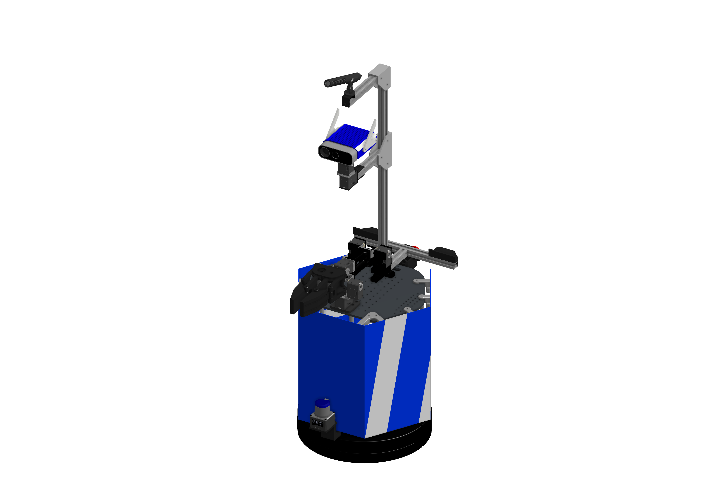

<a name="readme-top"></a>

[JA](README.md) | [EN](README.en.md)

[![Contributors][contributors-shield]][contributors-url]
[![Forks][forks-shield]][forks-url]
[![Stargazers][stars-shield]][stars-url]
[![Issues][issues-shield]][issues-url]
[![License][license-shield]][license-url]

# SOBIT EDU

<!-- 目次 -->
<details>
  <summary>目次</summary>
  <ol>
    <li>
      <a href="#概要">概要</a>
    </li>
    <li>
      <a href="#セットアップ">セットアップ</a>
      <ul>
        <li><a href="#環境条件">環境条件</a></li>
        <li><a href="#インストール方法">インストール方法</a></li>
      </ul>
    </li>
    <li>
    　<a href="#実行・操作方法">実行・操作方法</a>
      <ul>
        <li><a href="#Rviz上の可視化">Rviz上の可視化</a></li>
      </ul>
    </li>
    <li>
    　<a href="#ソフトウェア">ソフトウェア</a>
      <ul>
        <li><a href="#ジョイントコントローラ">ジョイントコントローラ</a></li>
        <li><a href="#ホイールコントローラ">ホイールコントローラ</a></li>
      </ul>
    </li>
    <li>
    　<a href="#ハードウェア">ハードウェア</a>
      <ul>
        <li><a href="#パーツのダウンロード方法">パーツのダウンロード方法</a></li>
        <li><a href="#ロボットの組み立て">ロボットの組み立て</a></li>
        <li><a href="#ロボットの特徴">ロボットの特徴</a></li>
        <li><a href="#部品リスト（BOM）">部品リスト（BOM）</a></li>
      </ul>
    </li>
    <li><a href="#マイルストーン">マイルストーン</a></li>
    <li><a href="#変更履歴">変更履歴</a></li>
    <!-- <li><a href="#contributing">Contributing</a></li> -->
    <!-- <li><a href="#license">License</a></li> -->
    <li><a href="#参考文献">参考文献</a></li>
  </ol>
</details>


<!-- レポジトリの概要 -->
## 概要



TurtleBot2をベースとしてSOBITSが開発したモバイルマニピュレータ（SOBIT EDU）を動かすためのライブラリです．

> [!WARNING]
> 初心者の場合，実機のロボットを扱う際に，先輩方に付き添ってもらいながらロボットを動かしましょう．

<p align="right">(<a href="#readme-top">上に戻る</a>)</p>


<!-- セットアップ -->
## セットアップ

ここで，本レポジトリのセットアップ方法について説明します．

### 環境条件

まず，以下の環境を整えてから，次のインストール段階に進んでください．

| System  | Version |
| ------------- | ------------- |
| Ubuntu | 20.04 (Focal Fossa) |
| ROS | Noetic Ninjemys |
| Python | 3.8 |

> [!NOTE]
> `Ubuntu`や`ROS`のインストール方法に関しては，[SOBIT Manual](https://github.com/TeamSOBITS/sobits_manual#%E9%96%8B%E7%99%BA%E7%92%B0%E5%A2%83%E3%81%AB%E3%81%A4%E3%81%84%E3%81%A6)に参照してください．

### インストール方法

1. ROSの`src`フォルダに移動します．
   ```sh
   $ roscd
   # もしくは，"cd ~/catkin_ws/"へ移動．
   $ cd src/
   ```
2. 本レポジトリをcloneします．
   ```sh
   $ git clone https://github.com/TeamSOBITS/sobit_edu
   ```
3. レポジトリの中へ移動します．
   ```sh
   $ cd sobit_edu/
   ```
4. 依存パッケージをインストールします．
   ```sh
   $ bash install.sh
   ```
5. パッケージをコンパイルします．
   ```sh
   $ roscd
   # もしくは，"cd ~/catkin_ws/"へ移動．
   $ catkin_make
   ```


<p align="right">(<a href="#readme-top">上に戻る</a>)</p>


<!-- 実行・操作方法 -->
## 実行・操作方法

1. SOBIT EDUの起動する機能をパラメータとして[minimal.launch](sobit_edu_bringup/launch/minimal.launch)に設定します．
   ```xml
    <!-- Activate Mobile-Base (true), Arm (true), Head (true) -->
    <arg name="enable_mb"           default="true"/>
    <arg name="enable_arm"          default="true"/>
    <arg name="enable_head"         default="true"/>
    ...
    <arg name="open_rviz"           default="true"/>
    ...
   ```
> [!NOTE]
> 使用したい機能に応じて，`true`か`false`かに書き換えてください．

2. [minimal.launch](sobit_edu_bringup/launch/minimal.launch)というlaunchファイルを実行します．
   ```sh
   $ roslaunch sobit_edu_bringup minimal.launch
   ```
3. [任意] デモプログラムを実行してみましょう．
   ```sh
   $ rosrun sobit_edu_library test_controll_wheel.py
   ```

> [!NOTE]
> SOBIT EDUの動作方法になれるため，[example](sobit_edu_library/example/)フォルダを確認し，それぞれのサンプルファイルから動作関数を学びましょう．

<p align="right">(<a href="#readme-top">上に戻る</a>)</p>


### Rviz上の可視化
実機を動かす前段階として，Rviz上でSOBIT EDUを可視化し，ロボットの構成を表示することができます．

```sh
$ roslaunch sobit_edu_description display.launch
```

正常に動作した場合は，次のようにRvizが表示されます．


<p align="right">(<a href="#readme-top">上に戻る</a>)</p>


## ソフトウェア
<details>
<summary>SOBIT EDUと関わるソフトの情報まとめ</summary>


### ジョイントコントローラ
SOBIT EDUのパンチルト機構とマニピュレータを動かすための情報まとめです．

<p align="right">(<a href="#readme-top">上に戻る</a>)</p>


#### 動作関数
1.  `moveToPose()` : 決められたポーズに動かします．
    ```cpp
    bool moveToPose(
        const std::string& pose_name,   // ポーズ名
        const double sec = 5.0          // 動作時間 (s)
    );
    ```

> [!NOTE]
> 既存のポーズは[sobit_edu_pose.yaml](sobit_edu_library/config/sobit_edu_pose.yaml)に確認でいます．ポーズの作成方法については[ポーズの設定方法](#ポーズの設定方法)をご参照ください．

2.  `moveJoint()` : 指定されたジョイントを任意の角度を動かします．
    ```cpp
    bool sobit::SobitEduJointController::moveJoint (
        const Joint joint_num,          // ジョイント名 (定数名)
        const double rad,               // 回転角度 (rad)
        const double sec = 5.0,         // 回転時間 (s)
        bool is_sleep = true            // 回転後に待機するかどうか
    );
    ```

> [!NOTE]
> `ジョイント名`は[ジョイント名](#ジョイント名)をご確認ください．

3.  `moveAllJoint()` : 指定されたジョイントを任意の角度を動かします．
    ```cpp
    bool sobit::SobitEduJointController::moveJoint (
        const double arm_shoulder_pan,  // 各ジョイントの回転角度(arm_shoulder_pan) 
        const double arm_shoulder_tilt, // 各ジョイントの回転角度(arm_shoulder_tilt)
        const double arm_elbow_tilt,    // 各ジョイントの回転角度(arm_elbow_tilt)
        const double arm_wrist_tilt,    // 各ジョイントの回転角度(arm_wrist_tilt)
        const double hand,              // 各ジョイントの回転角度(hand)
        const double head_camera_pan,   // 各ジョイントの回転角度(head_camera_pan)
        const double head_camera_tilt,  // 各ジョイントの回転角度(head_camera_tilt)
        const double sec = 5.0,         // 回転時間 (s)
        bool is_sleep = true            // 回転後に待機するかどうか
    );
    ```

1.  `moveHeadPanTilt()` : パンチルト機構を任意の角度に動かす
    ```cpp
    bool sobit::SobitEduJointController::moveHeadPanTilt(
        const double pan_rad,           // パンの回転角度 (rad)
        const double tilt_rad,          // チルトの回転角度 (rad)
        const double sec = 5.0,         // 移動時間 (s)
        bool is_sleep = true            // 回転後に待機するかどうか
    );
    ```
 
1.  `moveArm()` : アームの関節を任意の角度に動かします．
    ```cpp
    bool sobit::SobitEduJointController::moveArm(
        const double arm_shoulder_pan,  // 各ジョイントの回転角度(arm_shoulder_pan) 
        const double arm_shoulder_tilt, // 各ジョイントの回転角度(arm_shoulder_tilt)
        const double arm_elbow_tilt,    // 各ジョイントの回転角度(arm_elbow_tilt)
        const double arm_wrist_tilt,    // 各ジョイントの回転角度(arm_wrist_tilt)
        const double hand,              // 各ジョイントの回転角度(hand)
        const double sec = 5.0,         // 回転時間 (s)
        bool is_sleep = true            // 回転後に待機するかどうか
    );
    ```


1.  `moveGripperToTargetCoord()` : ハンドをxyz座標に動かします（把持モード）．
    ```cpp
    bool sobit::SobitEduJointController::moveGripperToTargetCoord(
        const double goal_position_x,       // 把持目的地のx (m)
        const double goal_position_y,       // 把持目的地のy (m)
        const double goal_position_z,       // 把持目的地のz (m)
        const double diff_goal_position_x,  // xyz座標のx軸をシフトする (m)
        const double diff_goal_position_y,  // xyz座標のy軸をシフトする (m)
        const double diff_goal_position_z   // xyz座標のz軸をシフトする (m)
    );
    ```

1.  `moveGripperToTargetTF()` : ハンドをtf名に動かします（把持モード）．
    ```cpp
    bool sobit::SobitEduJointController::moveGripperToTargetTF(
        const std::string& target_name,     // 把持目的tf名
        const double diff_goal_position_x,  // xyz座標のx軸をシフトする (m)
        const double diff_goal_position_y,  // xyz座標のy軸をシフトする (m)
        const double diff_goal_position_z   // xyz座標のz軸をシフトする (m)
    );
    ```

1.  `moveGripperToPlaceCoord()` : ハンドをxyz座標に動かします（配置モード）．
    ```cpp
    bool sobit::SobitEduJointController::moveGripperToPlaceCoord(
        const double goal_position_x,       // 配置目的地のx (m)
        const double goal_position_y,       // 配置目的地のy (m)
        const double goal_position_z,       // 配置目的地のz (m)
        const double diff_goal_position_x,  // xyz座標のx軸をシフトする (m)
        const double diff_goal_position_y,  // xyz座標のy軸をシフトする (m)
        const double diff_goal_position_z   // xyz座標のz軸をシフトする (m)
    ); 
    ```

1.  `moveGripperToPlaceTF()` : ハンドをtf名に動かします（配置モード）．
    ```cpp
    bool sobit::SobitEduJointController::moveGripperToPlaceTF(
        const std::string& target_name,     // 配置目的tf名
        const double diff_goal_position_x,  // xyz座標のx軸をシフトする (m)
        const double diff_goal_position_y,  // xyz座標のy軸をシフトする (m)
        const double diff_goal_position_z   // xyz座標のz軸をシフトする (m)
    );
    ```

1.  `graspDecision()` : 定めた範囲内の電流値を超えた場合，把持判定を返す．
    ```cpp
    bool sobit::SobitEduJointController::graspDecision(
        const int min_curr = 300,       // trueを返す最小の電流値
        const int max_curr = 1000       // trueを返す最大の電流値
     );
    ```

1.  `placeDecision()` : 定めた範囲内の電流値を超えた場合，配置判定を返す．
    ```cpp
    bool sobit::SobitEduJointController::graspDecision( 
        const int min_curr = 500,       // trueを返す最小の電流値
        const int max_curr = 1000       // trueを返す最大の電流値
    );
    ```

<p align="right">(<a href="#readme-top">上に戻る</a>)</p>


#### ジョイント名
SOBIT EDUのジョイント名とその定数名を以下の通りです．


| ジョイント番号 | ジョイント名 | ジョイント定数名 |
| :---: | --- | --- |
| 0 | arm_shoulder_pan_joint | ARM_SHOULDER_PAN_JOINT |
| 1 | arm_shoulder_1_tilt_joint | ARM_SHOULDER_1_TILT_JOINT |
| 2 | arm_shoulder_2_tilt_joint | ARM_SHOULDER_2_TILT_JOINT |
| 3 | arm_elbow_1_tilt_joint | ARM_ELBOW_1_TILT_JOINT |
| 4 | arm_elbow_2_tilt_joint | ARM_ELBOW_2_TILT_JOINT |
| 5 | arm_wrist_tilt_joint | ARM_WRIST_TILT_JOINT |
| 6 | hand_joint | HAND_JOINT |
| 7 | head_camera_pan_joint | HEAD_CAMERA_PAN_JOINT |
| 8 | head_camera_tilt_joint | HEAD_CAMERA_TILT_JOINT |


<p align="right">(<a href="#readme-top">上に戻る</a>)</p>


#### ポーズの設定方法
[sobit_edu_pose.yaml](sobit_edu_library/config/sobit_edu_pose.yaml)というファイルでポーズの追加・編集ができます．以下のようなフォーマットになります．

```yaml
sobit_edu_pose:
    - { 
        pose_name: "pose_name",
        arm_shoulder_pan_joint: 0.00,
        arm_shoulder_1_tilt_joint: 1.5708,
        arm_shoulder_2_tilt_joint: -1.5708,
        arm_elbow_1_tilt_joint: -1.40,
        arm_elbow_2_tilt_joint: 1.40,
        arm_wrist_tilt_joint: -0.17,
        hand_joint: -1.00,
        head_camera_pan_joint: 0.00,
        head_camera_tilt_joint: 0.00
    }
    ...
```  

### ホイールコントローラ
SOBIT EDUの移動機構を動かすための情報まとめです．

<p align="right">(<a href="#readme-top">上に戻る</a>)</p>


#### 動作関数
1.  `controlWheelLinear()` : 並進（直進移動・斜め移動・横移動）を移動させます．
    ```cpp
    bool sobit::SobitEduWheelController::controlWheelLinear (
        const double distance,            // 直進移動距離 (m)
    )
    ```  
2.  `controlWheelRotateRad()` : 回転運動を行う(弧度法：Radian)
    ```cpp
    bool sobit::SobitEduWheelController::controlWheelRotateRad (
        const double angle_rad,             // 中心回転角度 (rad)
    )
    ```  
3.  `controlWheelRotateDeg()`   :   回転運動を行う(度数法：Degree)
    ```cpp
    bool sobit::SobitEduWheelController::controlWheelRotateDeg ( 
        const double angle_deg,             // 中心回転角度 (deg)
    )
    ```

</details>

<p align="right">(<a href="#readme-top">上に戻る</a>)</p>


## ハードウェア
SOBIT EDUはオープンソースハードウェアとして[OnShape](https://cad.onshape.com/documents/0aff733aa8798f27efd96de3/w/e6c482276f9b94eef89215b6/e/a80437dc83d4b5d5f30b153e?renderMode=0&uiState=654e03c33dd8e732221dd868)にて公開しております．


<p align="right">(<a href="#readme-top">上に戻る</a>)</p>


<details>
<summary>ハードウェアの詳細についてはこちらを確認してください．</summary>

### パーツのダウンロード方法

1. Onshapeにアクセスしましょう．

> [!NOTE]
> ファイルをダウンロードするために，`OnShape`のアカウントを作成する必要がありません．ただし，本ドキュメント全体をコピする場合，アカウントの作成を推薦します．

2. `Instances`の中にパーツを右クリックで選択します．
2. 一覧が表示され，`Export`ボタンを押してください．
1. 表示されたウィンドウの中に，`Format`という項目があります．`STEP`を選択してください．
1. 最後に，青色の`Export`ボタンを押してダウンロードが開始されます．

<p align="right">(<a href="#readme-top">上に戻る</a>)</p>


### ロボットの組み立て
TBD

<p align="right">(<a href="#readme-top">上に戻る</a>)</p>


### ロボットの特徴
| 項目 | 詳細 |
| --- | --- |
| 最大直進速度 | 0.65[m/s] |
| 最大回転速度 | 3.1415[rad/s] |
| 最大ペイロード | 0.35[kg] |
| サイズ (長さx幅x高さ) | 640x400x1150[mm] |
| 重量 | 10.5[kg] |
| リモートコントローラ | PS3/PS4 |
| LiDAR | UST-20LX |
| RGB-D | Azure Kinect DK|
| IMU | LSM6DSMUS |
| スピーカー | モノラルスピーカー |
| マイク | モノラルガンマイクロホン |
| アクチュエータ (アーム) |7 x XM430-W320 |
| 移動機構 | TurtleBot2 |
| 電源 | 2 x Makita 6.0Ah 18V |
| PC接続 | USB |

<p align="right">(<a href="#readme-top">上に戻る</a>)</p>


### 部品リスト（BOM）

| 部品 | 型番 | 個数 | 購入先 |
| --- | --- | --- | --- |
| --- | --- | 1 | [link]() |
| --- | --- | 1 | [link]() |
| --- | --- | 1 | [link]() |
| --- | --- | 1 | [link]() |
| --- | --- | 1 | [link]() |
| --- | --- | 1 | [link]() |
| --- | --- | 1 | [link]() |
| --- | --- | 1 | [link]() |
| --- | --- | 1 | [link]() |
| --- | --- | 1 | [link]() |
| --- | --- | 1 | [link]() |
| --- | --- | 1 | [link]() |
| --- | --- | 1 | [link]() |

</details>

<p align="right">(<a href="#readme-top">上に戻る</a>)</p>


<!-- マイルストーン -->
## マイルストーン

- [x] exampleファイルの修正
- [x] OSS
    - [x] ドキュメンテーションの充実
    - [x] コーディングスタイルの統一

現時点のバッグや新規機能の依頼を確認するために[Issueページ][license-url] をご覧ください．

<p align="right">(<a href="#readme-top">上に戻る</a>)</p>


<!-- 変更履歴 -->
## 変更履歴

- 

<p align="right">(<a href="#readme-top">上に戻る</a>)</p>


<!-- CONTRIBUTING -->
<!-- ## Contributing

Contributions are what make the open source community such an amazing place to learn, inspire, and create. Any contributions you make are **greatly appreciated**.

If you have a suggestion that would make this better, please fork the repo and create a pull request. You can also simply open an issue with the tag "enhancement".
Don't forget to give the project a star! Thanks again!

1. Fork the Project
2. Create your Feature Branch (`git checkout -b feature/AmazingFeature`)
3. Commit your Changes (`git commit -m 'Add some AmazingFeature'`)
4. Push to the Branch (`git push origin feature/AmazingFeature`)
5. Open a Pull Request

<p align="right">(<a href="#readme-top">上に戻る</a>)</p> -->


<!-- LICENSE -->
<!-- ## License

Distributed under the MIT License. See `LICENSE.txt` for more NOTErmation.

<p align="right">(<a href="#readme-top">上に戻る</a>)</p> -->


<!-- 参考文献 -->
## 参考文献

* [Dynamixel SDK](https://emanual.robotis.com/docs/en/software/dynamixel/dynamixel_sdk/overview/)
* [ROS Noetic](http://wiki.ros.org/noetic)
* [ROS Control](http://wiki.ros.org/ros_control)

<p align="right">(<a href="#readme-top">上に戻る</a>)</p>


<!-- MARKDOWN LINKS & IMAGES -->
<!-- https://www.markdownguide.org/basic-syntax/#reference-style-links -->
[contributors-shield]: https://img.shields.io/github/contributors/TeamSOBITS/sobit_edu.svg?style=for-the-badge
[contributors-url]: https://github.com/TeamSOBITS/sobit_edu/graphs/contributors
[forks-shield]: https://img.shields.io/github/forks/TeamSOBITS/sobit_edu.svg?style=for-the-badge
[forks-url]: https://github.com/TeamSOBITS/sobit_edu/network/members
[stars-shield]: https://img.shields.io/github/stars/TeamSOBITS/sobit_edu.svg?style=for-the-badge
[stars-url]: https://github.com/TeamSOBITS/sobit_edu/stargazers
[issues-shield]: https://img.shields.io/github/issues/TeamSOBITS/sobit_edu.svg?style=for-the-badge
[issues-url]: https://github.com/TeamSOBITS/sobit_edu/issues
[license-shield]: https://img.shields.io/github/license/TeamSOBITS/sobit_edu.svg?style=for-the-badge
[license-url]: LICENSE
